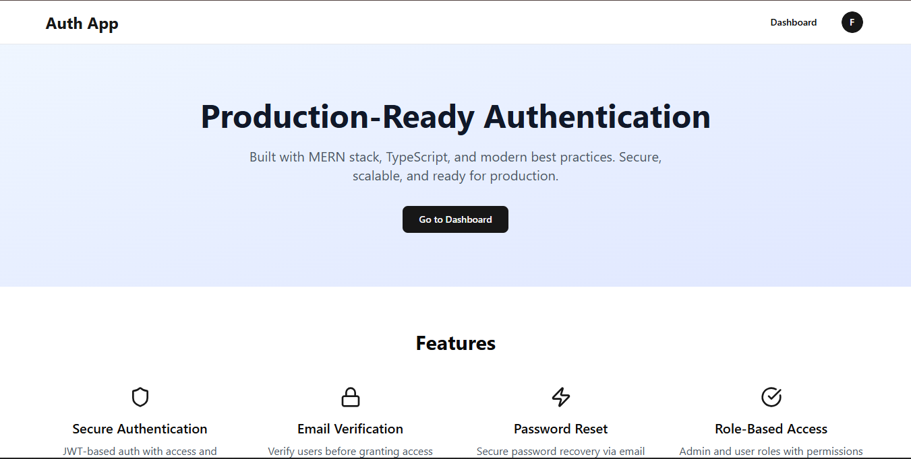
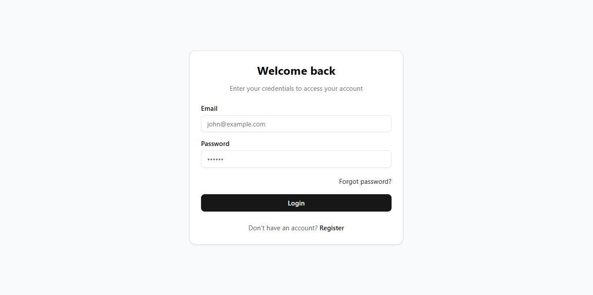
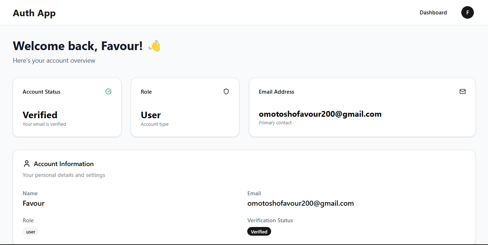
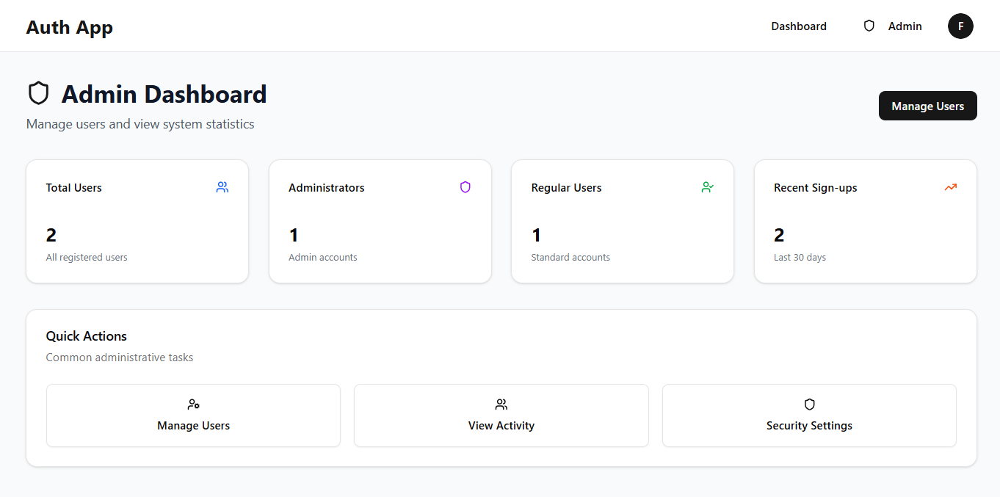
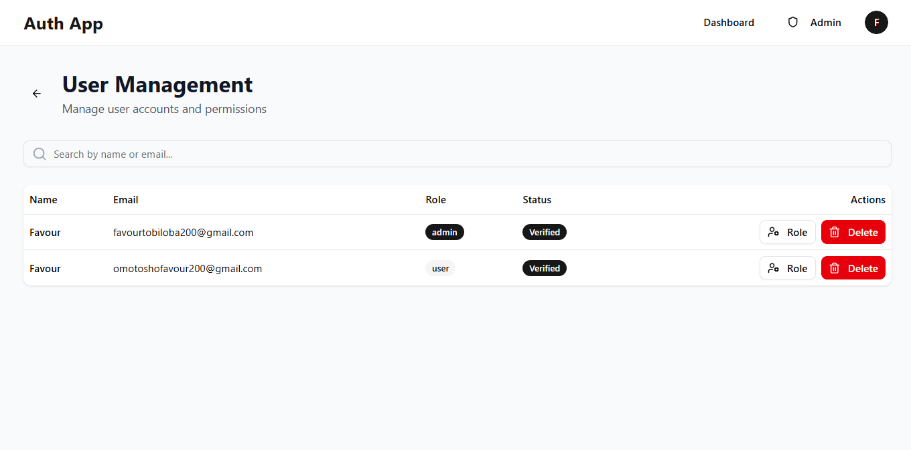

# MERN Auth - Frontend

Modern, production-ready authentication frontend built with React, TypeScript, and Tailwind CSS.

## 🌐 Live Demo

**Frontend:** https://client-mu-ebon.vercel.app/

## 📸 Screenshots







## ✨ Features

### Authentication

- 🔐 Secure login and registration
- ✉️ Email verification with token
- 🔄 Password reset functionality
- 🚪 Auto token refresh (seamless UX)
- 👋 Logout with session cleanup

### User Features

- 📊 Personal dashboard
- 👤 User profile display
- 🔔 Toast notifications
- 📱 Fully responsive design

### Admin Features

- 👑 Admin-only routes
- 📈 User statistics dashboard
- 👥 User management table
- 🔍 Search and filter users
- ⚙️ Update user roles
- 🗑️ Delete users

## 🛠️ Tech Stack

### Core

- **React 18** - UI library
- **TypeScript** - Type safety
- **Vite** - Build tool (super fast!)

### State & Routing

- **React Context API** - Global auth state
- **React Router v6** - Client-side routing

### UI & Styling

- **Tailwind CSS** - Utility-first styling
- **shadcn/ui** - Beautiful component library
- **Radix UI** - Accessible primitives
- **Lucide React** - Icon library

### Forms & Validation

- **React Hook Form** - Form state management
- **Zod** - Schema validation

### HTTP & Data

- **Axios** - HTTP client with interceptors
- **React Hot Toast** - Notifications

## 📦 Installation

### Prerequisites

- Node.js 18+
- npm or yarn

### Setup

```bash
# Clone the repository
git clone https://github.com/Favourof/client
cd client

# Install dependencies
npm install

# Create environment file
cp .env.example .env

# Start development server
npm run dev
```

### Environment Variables

Create `.env` file:

```env
VITE_API_URL=http://localhost:4001/api
```

For production:

```env
VITE_API_URL=https://your-backend-url.com/api
```

## 🚀 Available Scripts

```bash
# Development server (http://localhost:5173)
npm run dev

# Type check
npm run type-check

# Build for production
npm run build

# Preview production build
npm run preview

# Lint code
npm run lint
```

## 📁 Project Structure

```
client/
├── src/
│   ├── components/
│   │   ├── ui/              # shadcn/ui components
│   │   ├── auth/            # Auth-specific components
│   │   │   ├── ProtectedRoute.tsx
│   │   │   └── AdminRoute.tsx
│   │   └── layout/
│   │       ├── Layout.tsx
│   │       └── Navbar.tsx
│   ├── pages/
│   │   ├── Home.tsx
│   │   ├── Dashboard.tsx
│   │   ├── auth/
│   │   │   ├── Login.tsx
│   │   │   ├── Register.tsx
│   │   │   ├── VerifyEmail.tsx
│   │   │   ├── ForgotPassword.tsx
│   │   │   └── ResetPassword.tsx
│   │   └── admin/
│   │       ├── AdminDashboard.tsx
│   │       └── UserManagement.tsx
│   ├── context/
│   │   └── AuthContext.tsx   # Global auth state
│   ├── hooks/
│   │   └── useAuth.ts        # Auth hook
│   ├── services/
│   │   ├── api.ts            # Axios instance
│   │   ├── auth.service.ts   # Auth API calls
│   │   └── admin.service.ts  # Admin API calls
│   ├── types/
│   │   └── index.ts          # TypeScript types
│   ├── utils/
│   │   ├── constants.ts
│   │   └── errorHandler.ts   # Centralized error handling
│   ├── App.tsx
│   └── main.tsx
├── public/
├── index.html
├── vite.config.ts
├── tailwind.config.js
├── tsconfig.json
└── package.json
```

## 🎨 Key Features Explained

### 1. Auto Token Refresh

The app automatically refreshes expired access tokens:

```typescript
// src/services/api.ts
api.interceptors.response.use(
  (response) => response,
  async (error) => {
    if (error.response?.status === 401) {
      // Try to refresh token
      const { data } = await axios.post("/auth/refresh");
      // Retry original request
      return api(originalRequest);
    }
  },
);
```

### 2. Protected Routes

Routes require authentication:

```typescript
<Route
  path="/dashboard"
  element={
    <ProtectedRoute>
      <Dashboard />
    </ProtectedRoute>
  }
/>
```

### 3. Admin Routes

Admin-only access:

```typescript
<Route
  path="/admin"
  element={
    <AdminRoute>
      <AdminDashboard />
    </AdminRoute>
  }
/>
```

### 4. Type-Safe Forms

Forms with validation:

```typescript
const schema = z.object({
  email: z.string().email("Invalid email"),
  password: z.string().min(6, "Min 6 characters"),
});

const form = useForm({
  resolver: zodResolver(schema),
});
```

## 🔐 Security Features

- ✅ **httpOnly Cookies** - Refresh tokens stored securely
- ✅ **XSS Protection** - Tokens not accessible to JavaScript
- ✅ **CSRF Protection** - SameSite cookie attribute
- ✅ **Type Safety** - TypeScript prevents errors
- ✅ **Input Validation** - Zod schema validation
- ✅ **Auto Logout** - On token refresh failure

## 🎯 User Flows

### Registration Flow

```
1. User fills registration form
2. Validation with Zod
3. API call to backend
4. Email verification sent
5. User redirected to login
```

### Login Flow

```
1. User enters credentials
2. Validation
3. API call to backend
4. Access token stored in localStorage
5. Refresh token in httpOnly cookie
6. Redirect to dashboard
```

### Email Verification

```
1. User clicks link in email
2. Token extracted from URL
3. API call to verify
4. Success message
5. Auto redirect to login
```

## 📱 Responsive Design

Built mobile-first with Tailwind CSS:

- 📱 Mobile: Stacked layout
- 💻 Tablet: 2-column grid
- 🖥️ Desktop: Full width with sidebar

## 🐛 Common Issues

### CORS Errors

**Problem:** API calls blocked by CORS

**Solution:** Backend must allow your frontend origin:

```typescript
// backend
app.use(
  cors({
    origin: "https://your-frontend-url.com",
    credentials: true,
  }),
);
```

### Token Not Sent

**Problem:** Cookies not sent with requests

**Solution:** Enable credentials in Axios:

```typescript
axios.create({
  withCredentials: true,
});
```

### Build Errors

**Problem:** Type errors during build

**Solution:** Run type check first:

```bash
npm run type-check
```

## 🚀 Deployment

### Vercel (Recommended)

1. Push code to GitHub
2. Import project in Vercel
3. Set environment variables
4. Deploy!

### Environment Variables in Vercel

```
VITE_API_URL=https://your-backend.app/api
```

## 📈 Performance

- ⚡ Vite for instant HMR
- 📦 Code splitting with React Router
- 🎨 Tailwind CSS purging unused styles
- 🔄 Auto token refresh (no manual login)

## 🤝 Contributing

Contributions welcome! Please:

1. Fork the repo
2. Create feature branch
3. Commit changes
4. Push to branch
5. Open pull request

## 📄 License

MIT License - see LICENSE file

## 👤 Author

**Your Name**

- GitHub: [@yourusername](https://github.com/yourusername)
- LinkedIn: [Your Name](https://linkedin.com/in/yourname)
- Portfolio: [yourportfolio.com](https://yourportfolio.com)

## 🙏 Acknowledgments

- [shadcn/ui](https://ui.shadcn.com) - Component library
- [Radix UI](https://www.radix-ui.com) - Accessible primitives
- [Tailwind CSS](https://tailwindcss.com) - Styling
- [React Hook Form](https://react-hook-form.com) - Forms
- [Zod](https://zod.dev) - Validation

---

**⭐ If you found this helpful, please star the repo!**
